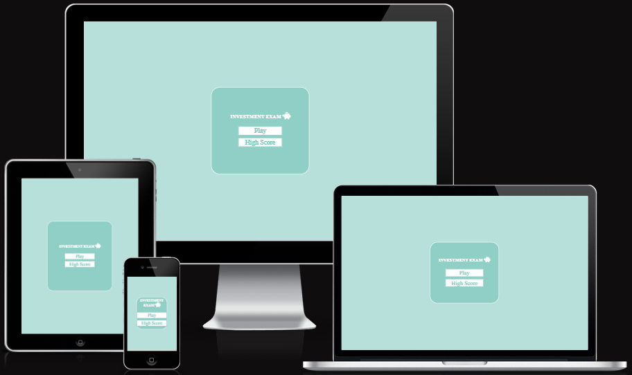

# Investing Exam

Investing Exam is a quiz where you can test your knowledge of investing money. The user will be provided with 10 questions, each with 4 options, among which one option will be the correct answer. The user will be able to view their score at the end of the quiz.

Live Website [here](https://danijuniordev.github.io/investing-challenge/)  

## User Experience (UX)
### Project Goal
Develop an interactive investment quiz aimed at educating users about key investment concepts, testing their knowledge, and empowering informed financial decision-making. The project aims to provide an engaging and educational experience by offering a series of challenging questions and answer options, allowing users to evaluate their performance at the end of the quiz.

### First Time User Goal
To introduce new users to the investment quiz, providing them with a seamless and intuitive experience that allows them to easily navigate the quiz, understand its purpose, and engage with the content. The goal is to ensure that first-time users feel comfortable and motivated to participate in the quiz, setting the stage for a positive and rewarding learning experience.

## User Stories
### First-Time Users
- **User-Friendly Interface:**:  
*I want the site to be intuitive and welcoming,so the user can easily undestand how to play and navegate trought the game*

- **Progress Tracking:**:  
*Display clear indicators of progress throughout the game, such as a progress bar and score, to show users how far they have progressed and how much is left to complete.*

- **Responsive Design:**: 
*Ensure that the website is optimized for various devices and screen sizes, including desktop computers, laptops, tablets, and smartphones. A responsive design will make it easier for users to access and play the game on their preferred device.*

## Design
### Colour Scheme
*Background Color (#b6e0d9 - Pale Turquoise):* This color choice can create a calming and inviting atmosphere, which can be beneficial for a quiz game website. Pale turquoise is soft on the eyes and provides a pleasant backdrop for the content.

*Question Text Color (#000000 - Black):* Black text on a light background offers high contrast and readability, ensuring that questions are easy to read for users. It's a classic choice that works well for conveying information clearly.

*Container Background Color (#FFFFFF - White):* Using white for containers helps create a clean and organized layout. White backgrounds provide a sense of spaciousness and allow other colors and elements to stand out effectively.

*Progress Bar and Score Color (#70c2b6):* This shade of greenish-blue adds a touch of vibrancy and energy to the interface. It can symbolize progress, growth, and success, which are all relevant to the context of a quiz game. Ensure that the progress bar and score are clearly visible against the background color for easy tracking.

## Wireframes

comming soon

### Features
The investment exam quiz game offers users interactive pages including the Home page, High score, Quiz game, Play again, and Save score, providing an engaging and educational experience for participants.