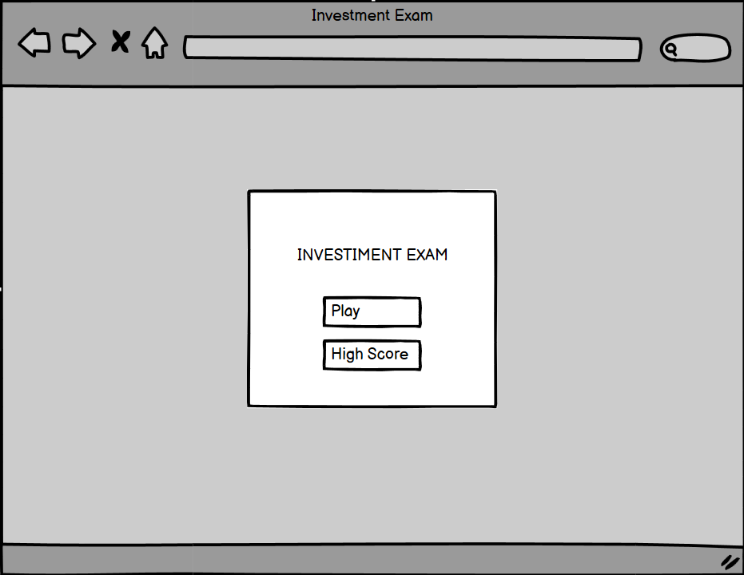
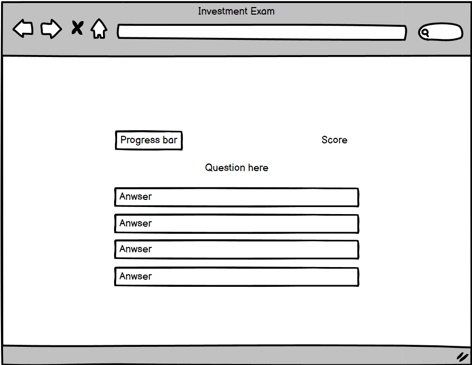
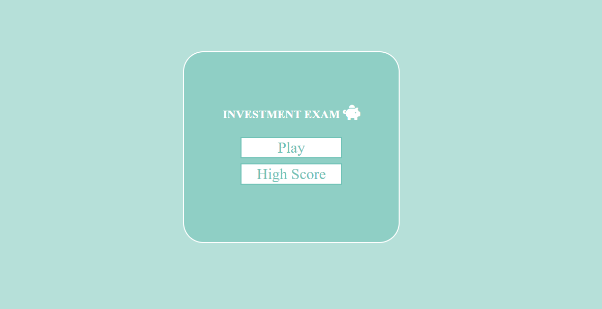
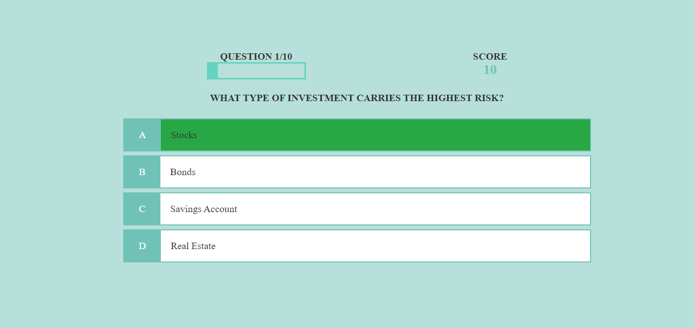
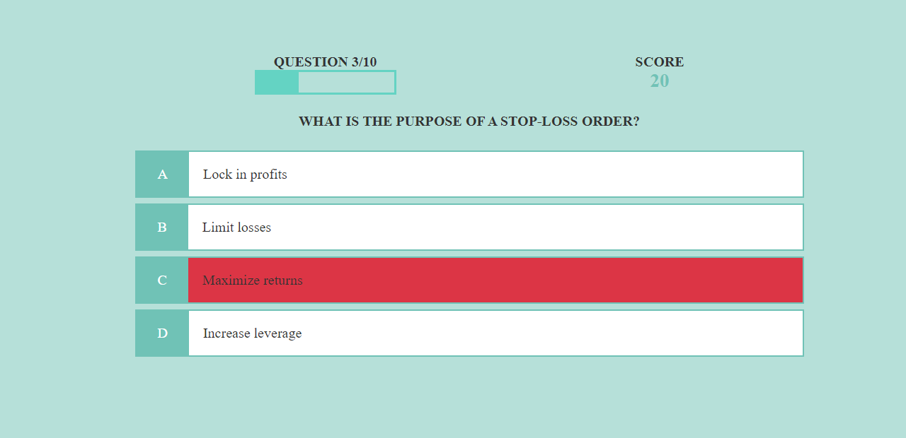
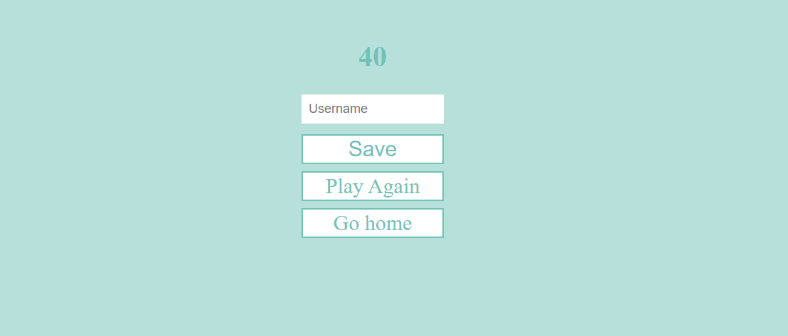
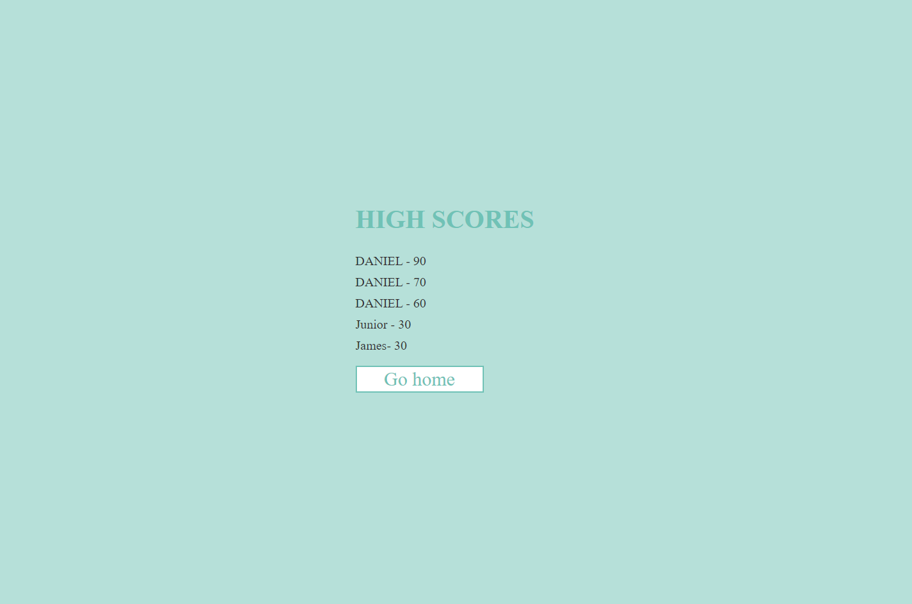
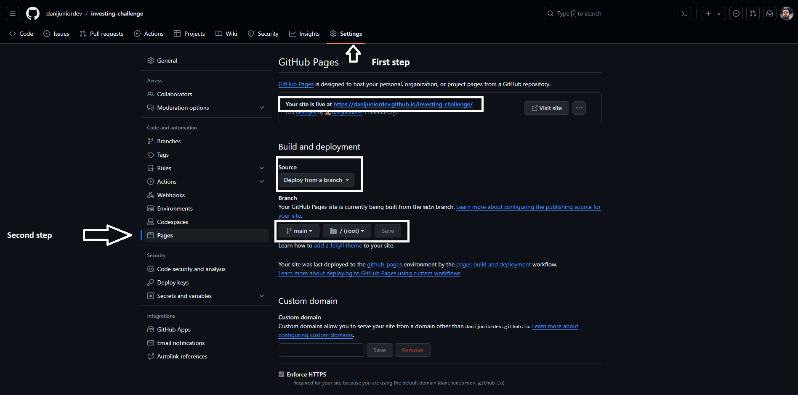

# Investing Exam

Investing Exam is a quiz where you can test your knowledge of investing money. The user will be provided with 10 questions, each with 4 options, among which one option will be the correct answer. The user will be able to view their score at the end of the quiz.

Live Website [here](https://danijuniordev.github.io/investing-challenge/)  

## User Experience (UX)
### Project Goal
Develop an interactive investment quiz aimed at educating users about key investment concepts, testing their knowledge, and empowering informed financial decision-making. The project aims to provide an engaging and educational experience by offering a series of challenging questions and answer options, allowing users to evaluate their performance at the end of the quiz.

### First Time User Goal
To introduce new users to the investment quiz, providing them with a seamless and intuitive experience that allows them to easily navigate the quiz, understand its purpose, and engage with the content. The goal is to ensure that first-time users feel comfortable and motivated to participate in the quiz, setting the stage for a positive and rewarding learning experience.

## User Stories
### First-Time Users
- **User-Friendly Interface:** 
I want the site to be intuitive and welcoming,so the user can easily undestand how to play and navegate trought the game

- **Progress Tracking:**  
Display clear indicators of progress throughout the game, such as a progress bar and score, to show users how far they have progressed and how much is left to complete.

- **Responsive Design:** 
Ensure that the website is optimized for various devices and screen sizes, including desktop computers, laptops, tablets, and smartphones. A responsive design will make it easier for users to access and play the game on their preferred device.

## Design
### Colour Scheme
**Background Color (#b6e0d9 - Pale Turquoise):** This color choice can create a calming and inviting atmosphere, which can be beneficial for a quiz game website. Pale turquoise is soft on the eyes and provides a pleasant backdrop for the content.

**Question Text Color (#000000 - Black):** Black text on a light background offers high contrast and readability, ensuring that questions are easy to read for users. It's a classic choice that works well for conveying information clearly.

**Container Background Color (#FFFFFF - White):** Using white for containers helps create a clean and organized layout. White backgrounds provide a sense of spaciousness and allow other colors and elements to stand out effectively.

**Progress Bar and Score Color (#70c2b6):** This shade of greenish-blue adds a touch of vibrancy and energy to the interface. It can symbolize progress, growth, and success, which are all relevant to the context of a quiz game. Ensure that the progress bar and score are clearly visible against the background color for easy tracking.

## Wireframes

 

## Features
The investment exam quiz game offers users interactive pages including the Home page, High score, Quiz game, Play again, and Save score, providing an engaging and educational experience for participants.

#### Welcome Cointainer 
- The quiz game consists of a Start button to initiate the quiz and a High Score button to access the leaderboard.

#### Progress Bar and Score
- The user can track their progress and view their score throughout the game.

#### Question Cointainer
-In the quiz interface, questions are presented alongside four options. Upon selecting an option, it is immediately highlighted with a color indication (green for correct and red for incorrect) to denote the accuracy of the choice. Additionally, the interface seamlessly transitions to the next question after a brief one-second interval, eliminating the need for the user to click a button to proceed.

#### Score Container
- After completing the quiz, the interface displays your result. You have the option to input your name and save your score, or alternatively, you can choose to play again or return to the home page.

#### High Score
- The user can also save their score, but first, they need to fill in their name in the input field. If the input field is left empty, the user won't be able to click on the save button.

## Technologies Used

 1. **HTML:** The structure of the website.
 2. **CSS:** Styling using custom CSS.
 3. **Javascript:** Used to provide functionality to make my website interactive.
 4. **Visual Studio Code:** Local IDE.
 5. **GitHub:** Source code hosting and deployment.
 6. **Git:** Version control.
 7. **Font Awesome:** Icons.
 8. **Favicon.io:** Favicon creation.
 9. **Balsamiq:** Wireframes design.

 ## Testing
 ### Manual Testing
* The website has been tested changing the sizes and using navigation bar on follow browsers: Chrome, Microsoft Edge, Opera, Firefox, Safari.
* For mobile testing, Google Chrome DevTools were utilized, and additional testing was conducted on a personal iPhone 11 Pro.
* Responsive design has been implemented and tested on standard screen sizes using the device toolbar in Google Chrome DevTools.

|----------------------------------------------------|-----------|
| Users can view quiz content by clicking start     | True      |
| Users can click the right answer and it displays green | True  |
| Users can click the wrong answer and it displays red | True   |
| Users cannot click any answer buttons once clicked | True    |
| Users can go to the next question without clicking any button | True |
| Users can view the question number they are currently on | True |
| Users can view the score                           | True      |
| Users can view the progress bar                    | True      |
| Users can save the score at the end of the game   | True      |

## Validator Testing

* HTML
  *  I can confirm that all HTML on each page has passed without error in the official [W3C Validator](https://validator.w3.org/#validate_by_input)

* CSS
  *  I can confirm that all CSS has passed without error in the official [Jigsaw Validator](https://jigsaw.w3.org/css-validator/#validate_by_input)

* JavaScript
  *  I can confirm that all JavaScript has passed without error in the official [JShint](https://jshint.com/)

## Deployment

**The project was deployed to GitHub Pages. These steps were followed:**

* Login in to your **Github**.
* From my GitHub project I went to **Settings**,
* Then selected **Pages** on the left hand menu,
* Under **Source** I selected **Deploy from a branch**,
* Finally, under **branch** I set it to **main** - **root** and save.

**Forking the GitHub Repository:**

* Find the repository you want to fork.
* Click on the **Fork** button,
* Wait for the forking process,
* Once the fork is complete, you will be redirected to the page of your new repository. The name will be something like "YourName/OriginalRepo.

**Cloning the GitHub Repository:**

* Find the relevant GitHub repository.
* Press the arrow on the **Code** button,
* Copy the **link** that is shown in the drop-down,
* Open the terminal, 
* Move to the folder you want clone it,
* In the terminal type **'git clone'** & then paste the link you copied in GitHub,
* Press enter and your local clone will be created.

The live website can be found here: <https://danijuniordev.github.io/investing-challenge/>